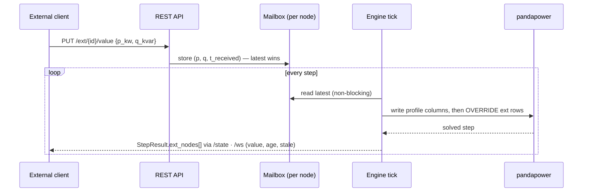
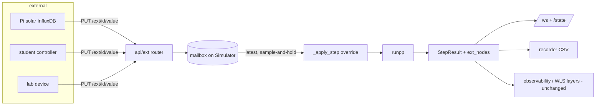

# External nodes — live data feed for individual buses

> **Status: PROPOSAL (2026-07-10).** Design draft ahead of the concept work
> (whiteboard session); nothing is implemented yet. Decisions marked
> *(open)* are explicitly up for discussion. Companion documents:
> [`ARCHITECTURE.md`](ARCHITECTURE.md), [`VERTIKALE_INTEGRATION.md`](VERTIKALE_INTEGRATION.md).

## 1. Motivation

netzsim currently knows two data sources for a node's behaviour: synthetic
daily profiles (LPG/EV/PV) and recorded real-PV day shapes. Both are fixed
before the simulation runs. The **external node** adds the third source:
a bus whose injection is driven **live from outside** while the engine
ticks — a *fully controlled node*.

Use cases:

1. **Hardware-in-the-loop** — a real device (smart meter readout, PV
   inverter, lab bench) feeds its actual measurements into the simulated
   grid.
2. **Co-simulation / student controllers** — an external script or EMS
   plays one household and reacts to what it observes.
3. **Live real data** — e.g. the existing rooftop-PV InfluxDB (Raspberry
   Pi) as a *live* feed instead of pre-recorded day shapes.
4. **Interactive teaching** — a second person at another laptop controls
   "their" house while the class watches the grid react.

## 2. Core concept: mailbox with sample-and-hold

The engine must never block on the network (one tick every 0.1–1 s).
External clients therefore **push** setpoints whenever they like; the
engine reads the **latest** value per tick, non-blocking (sample-and-hold).
No locks — a torn frame heals on the next step, consistent with the
project-wide convention.



## 3. Model

An external node is runtime equipment like batteries/meters/controllers —
its state lives **on the Simulator** (resets on grid swap, deep-copies for
the bulk exporter, *placement* persists in scenario recipes, values do not):

```python
@dataclass
class ExternalNode:
    eid: int
    bus: int
    name: str                    # "EXT_<bus>" pandapower load row
    p_mw: float = 0.0            # latest received setpoint (signed!)
    q_mvar: float = 0.0
    t_received: float | None = None   # monotonic timestamp of the last push
    hold_s: float = 30.0         # staleness threshold
    on_timeout: str = "hold"     # "hold" | "zero"   (open: "profile"?)
```

- Creating one adds a pandapower **load row with a zeroed profile row**
  (the proven `add_ev` pattern in `der.py`); every step overrides that
  row's `p_mw`/`q_mvar` from the mailbox — **signed P**: positive =
  consumption, negative = feed-in. One honest number instead of separate
  load/sgen bookkeeping.
- Apply point in `_apply_step`: after the profile columns, **before**
  controller factors and batteries.

## 4. Semantics (the teaching-relevant part)

| Aspect | Proposed rule |
|---|---|
| **Staleness** | If `now - t_received > hold_s`, the node is **stale**: `on_timeout="hold"` keeps the last value, `"zero"` drops to 0. Either way the StepResult carries `stale: true` and the UI shows ⚠️ — a silent dead feed must be visible. |
| **Controllers / Netzampel** | Do **not** throttle external nodes (v1): "fully controlled" means the Steuerbox has no lever there. *(open: optional `steerable` flag later.)* |
| **Observability** | Unchanged — the external injection is simply part of the truth. Unmetered ⇒ invisible to the operator; the WLS has no meaningful profile pseudo for it (treat like battery buses: wide, rating-bounded pseudo). An externally driven node is deliberately the hardest to estimate. |
| **Day graphs** | An external node has no future. The truth sweep uses its zeroed profile (contributes nothing to forecast curves); its profile panel shows the **received history** of the current day instead *(open: ring buffer of applied values)*. |
| **Scenarios** | Persist placements (`bus`, `name`, `hold_s`, `on_timeout`) — recipe, not snapshot. On load the node starts fresh (0 kW, unstale-until-timeout). |
| **Recording/export** | `ext_nodes[]` rows land in the CSV packs like batteries/controllers do. Bulk export replays with the *profile* value (0) — exports are deterministic, live feeds are not. |

## 5. API draft

| Method | Path | Purpose |
|---|---|---|
| POST | `/ext` | create at a bus `{bus, name?, hold_s?, on_timeout?}` |
| GET | `/ext` | list with live status (last value, age_s, stale) |
| PUT | `/ext/{id}/value` | **hot path**: `{p_kw, q_kvar?}` — validated (bounded), stored, 200 |
| POST | `/ext/values` | batch variant `[{id, p_kw, …}]` for multi-node feeders |
| DELETE | `/ext/{id}` | remove (row + profile row, like `remove_ev`) |

`StepResult` gains `ext_nodes: [{id, bus, p_mw, q_mvar, age_s, stale}]`.
REST at tick rate is sufficient (the engine consumes ≤ 1 value per tick);
a WebSocket ingest or MQTT bridge can be added later as a thin adapter
*outside* the core — the mailbox contract stays the same.

## 6. UI draft

- Element menu on a node: „📡 Externe Quelle anbinden…" — places the node,
  pins its section.
- Section block: live value (kW/kvar), age of the last telegram, ⚠️ „Quelle
  stumm seit …s" when stale, the timeout policy, remove button.
- Map badge 📡 next to the existing 🔋/📟/🎛 badges.

## 7. Phasing

1. **Backend core** — `ext.py` (dataclass + mailbox + step application),
   REST CRUD + value endpoint, StepResult fields, tests (latest-wins,
   staleness transitions, swap reset, exporter deepcopy, estimation
   honesty: unmetered external node stays invisible).
2. **UI** — placement, badge, live section, i18n (DE/EN).
3. **Demo feeder + manual chapter** — example client script (candidate:
   the Pi solar InfluxDB polled at 1 Hz → `PUT /ext/{id}/value`), scenario
   persistence, Benutzerhandbuch section.
4. *(optional later)* WS/MQTT ingest adapter, `steerable` flag,
   voltage-controlled mode.

## 8. Open questions (for the whiteboard)

1. **PQ only or also voltage control?** v1 proposal: PQ injection only.
   A voltage-regulated node (PV node / ext_grid-like) changes solver
   semantics and estimation assumptions — separate mode, later.
2. **`on_timeout="profile"`?** Fall back to a configured profile instead
   of hold/zero — useful for "device usually follows a profile, external
   feed overrides when present"?
3. **History depth** for the received-values graph (full day ring vs.
   last N minutes)?
4. **Multi-quantity feeds** — only P/Q, or also a temperature/price side
   channel for future coupling experiments?
5. **AuthN** — none today (local teaching tool); does an external-feed
   interface change that judgement?

## 9. Component fit


