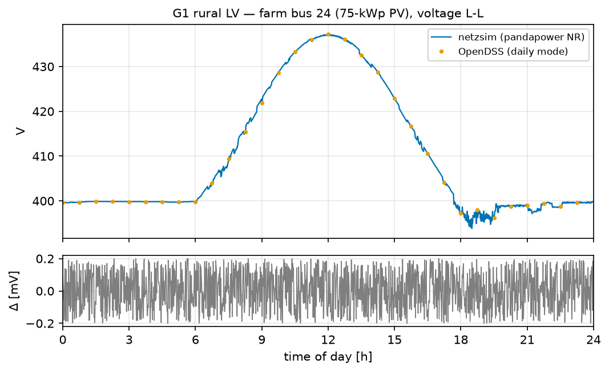
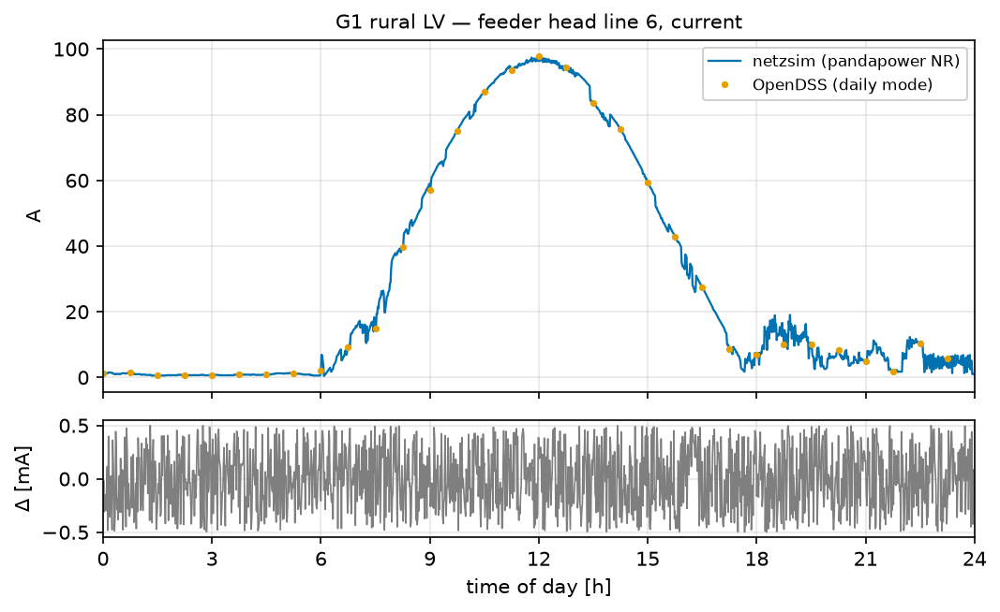
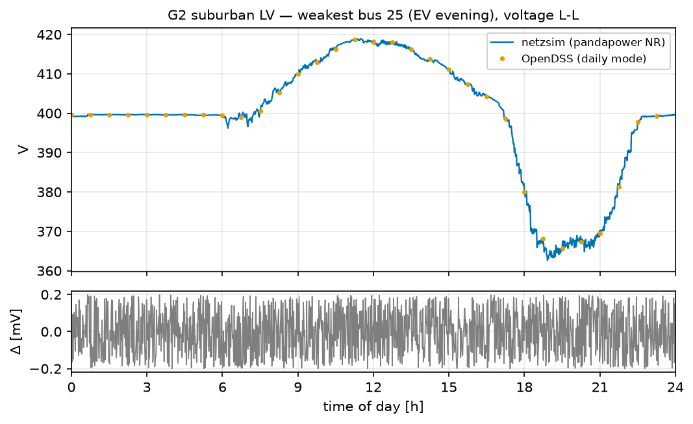
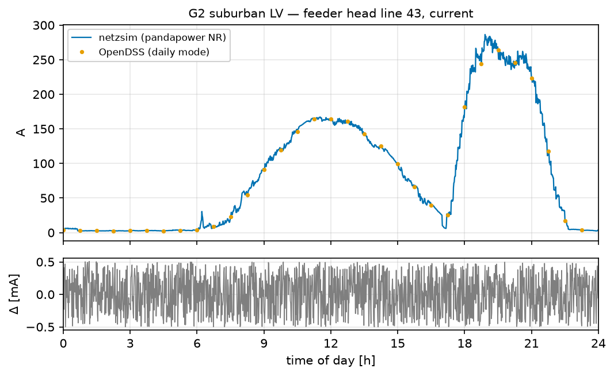
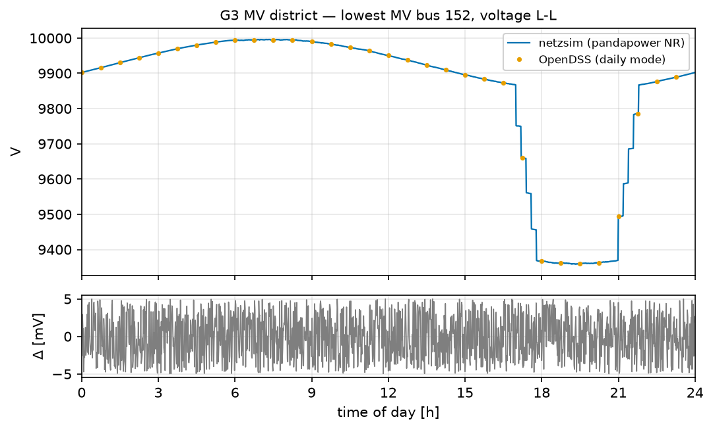
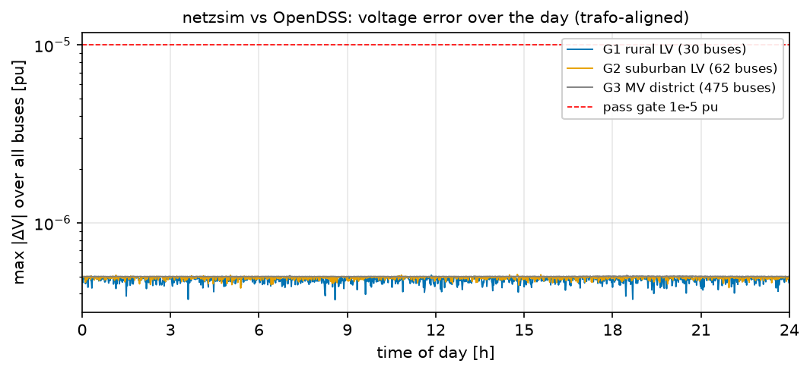

# Validation: netzsim vs OpenDSS and MATPOWER

> Generated by `benchmarks/make_report.py` — regenerate with `python benchmarks/run_all.py` (method & full plan: [`docs/BENCHMARKS.md`](../BENCHMARKS.md); exact engine versions: [`manifest.json`](manifest.json)). The source code of this repository is AI-generated (see the main README); this validation exists precisely so you don't have to take its word for it.

## What is compared

netzsim's full pipeline (input JSONs → network construction → 1440-step day) against two independent solvers on **balanced positive-sequence** models: **OpenDSS** in native daily mode (AltDSS engine — dss-extensions' regularly cross-validated implementation; the official EPRI 11.0.0.1 engine is installed and verified loadable, its scripted leg is a documented open item) and **real MATPOWER 8.1** on GNU Octave. Model alignment (fully disclosed): ideal slack, 50 Hz, `Vminpu=0`, wye-wye transformers with the magnetizing branch zeroed on both sides (plan §5.2) — the full-model supplementary runs quantify that alignment at ~2–3e-5 pu (the magnetizing-branch *position* differs between pandapower's T model and OpenDSS). Inputs are frozen fixtures (`benchmarks/fixtures/`, seeds baked in, SHA-256 in the manifest).

## T-series: IEEE cases, pandapower vs MATPOWER 8.1 (byte-identical case data)

| id | case | buses | max \|ΔVm\| [pu] | max \|ΔVa\| [deg] | gate | result |
|---|---|---|---|---|---|---|
| T4 | case9 | 9 | 4.441e-16 | 1.421e-14 | 1e-6 pu | ✅ PASS |
| T1 | case14 | 14 | 5.480e-12 | 2.620e-10 | 1e-6 pu | ✅ PASS |
| T2 | case_ieee30 | 30 | 2.647e-10 | 1.627e-08 | 1e-6 pu | ✅ PASS |
| T3 | case118 | 118 | 2.600e-12 | 2.966e-10 | 1e-6 pu | ✅ PASS |

## G-series: the committed teaching grids over the full 1440-step day

| grid | vs | model | max \|ΔV\| [pu] | mean \|ΔV\| [pu] | max \|ΔI\| [A] | gate | result |
|---|---|---|---|---|---|---|---|
| G1 rural LV — scenario 1 (75-kWp farm PV), 30 buses | OpenDSS (AltDSS) | aligned | 5.079e-07 | 2.416e-07 | 0.0005 | 1e-05 pu | ✅ PASS |
| G1 rural LV — scenario 1 (75-kWp farm PV), 30 buses | OpenDSS (AltDSS) | full model | 2.426e-05 | 2.172e-05 | 0.0022 | 1e-05 pu | ℹ️ supplementary |
| G1 rural LV — scenario 1 (75-kWp farm PV), 30 buses | MATPOWER 8.1 | aligned | 5.061e-07 | 2.416e-07 | — | 1e-05 pu | ✅ PASS |
| G2 suburban LV — scenario 2 (EV evening), 62 buses | OpenDSS (AltDSS) | aligned | 5.129e-07 | 2.468e-07 | 0.0005 | 1e-05 pu | ✅ PASS |
| G2 suburban LV — scenario 2 (EV evening), 62 buses | OpenDSS (AltDSS) | full model | 3.201e-05 | 2.264e-05 | 0.0099 | 1e-05 pu | ℹ️ supplementary |
| G2 suburban LV — scenario 2 (EV evening), 62 buses | MATPOWER 8.1 | aligned | 5.131e-07 | 2.468e-07 | — | 1e-05 pu | ✅ PASS |
| G3 MV district — 475 buses incl. 110-kV feed | OpenDSS (AltDSS) | aligned | 5.073e-07 | 2.494e-07 | 0.0005 | 1e-05 pu | ✅ PASS |
| G3 MV district — 475 buses incl. 110-kV feed | MATPOWER 8.1 | aligned | 5.154e-07 | 2.494e-07 | — | 1e-05 pu | ✅ PASS |

The *full model* rows keep the transformer magnetizing branch on both sides and measure the shunt-**position** difference between the tools — they are reported for transparency, the *aligned* rows are the pass/fail gate runs.

## Daily profiles (netzsim line, OpenDSS dots, Δ below)



*G1: the scenario-1 story — 75-kWp PV lifts the farm bus to ≈437 V L-L (252 V L-N) at noon; both tools agree to ±0.2 mV.*



*G1 feeder head current.*



*G2: the EV-evening dip at the weakest bus.*



*G2 feeder head current — the NH-fuse plateau of scenario 2.*



*G3: the lowest MV bus of the 475-bus district (Δ in mV at 10 kV).*



*Max voltage error across all buses per step — the agreement holds through PV noon and EV evening, orders below the 1e-5-pu gate.*

## Reproduce

```
py -3.12 -m venv .venv-bench
.venv-bench\Scripts\pip install -r benchmarks\requirements.txt
# GNU Octave 11.3.0 + set OCTAVE_EXECUTABLE (see docs/BENCHMARKS.md §3.2)
.venv-bench\Scripts\python benchmarks\run_all.py
```

Known limitations: balanced positive-sequence only (the unbalanced IEEE feeders are out of scope by design); the ±0.2-mV noise floor is the 1-W rounding of the frozen fixture profiles; vector-group angle shifts are dropped (magnitude comparison).
